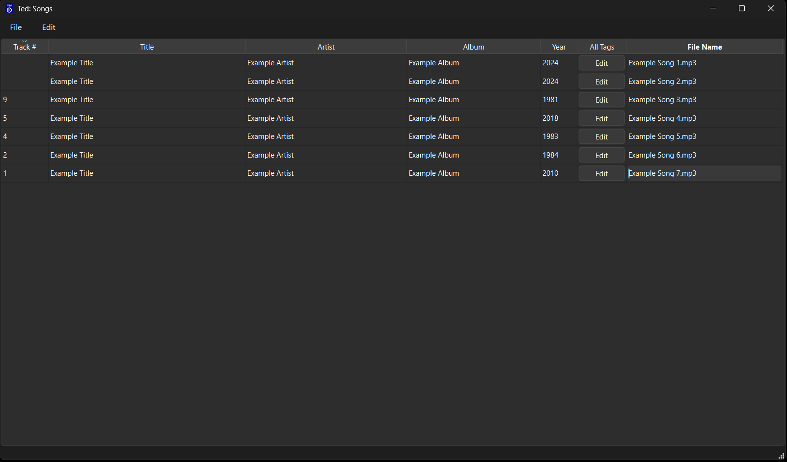
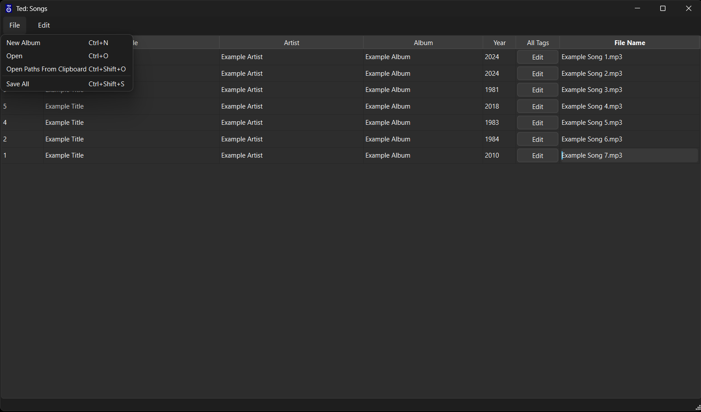
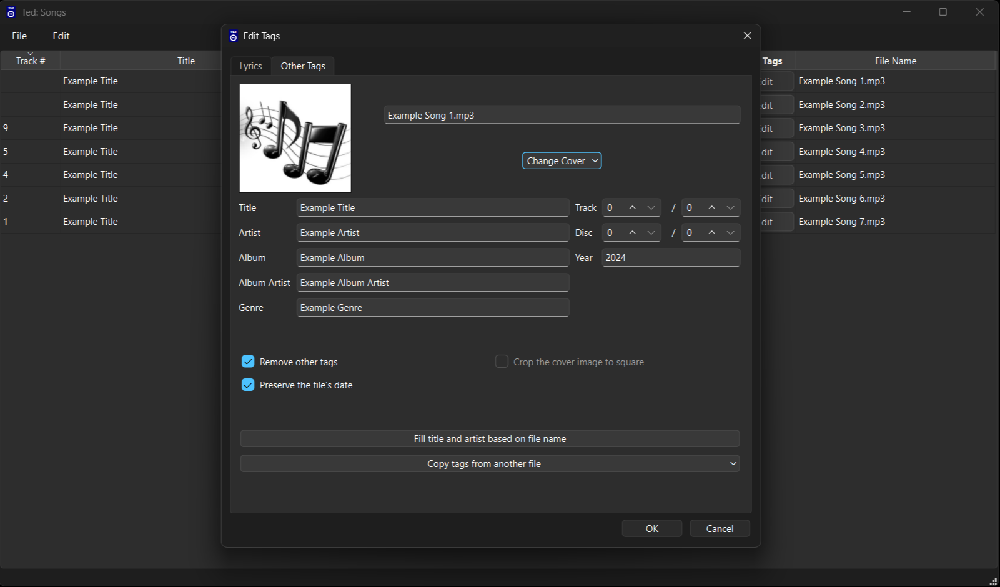

#  TEd
A fast and simple GUI-based MP3 tag editor for Windows and Linux

## Why?
The tag editors for the music players that I have used have always fallen short when it
came to making the whole process as fast and comfortable as possible
so I decided to write my own for the following reasons:

### Useless Tags
I almost never use most of the tags that are available. I only need them to be cleared/removed in
most cases.

### Bulk Tag Editing
Sometimes there are multiple files that need to share some tags (i.e. album, artist, year, cover).\
I know that this is possible with other tag editors but in TEd it's much clearer that you want
to make an album and the interface I believe is much more direct and clear.

### File Timestamp Preservation
This is perhaps the most important one: Do not update the modification date of the mp3 file.
I sort my songs based on their modification date and I like to keep them in the order they were 
added. But normally what happens is that I want to update an older file for whatever reason and 
when I do, the file is at the top of my playlist because its modification date has been updated.
I understand this is normal behavior but I have a very specific setup so for my case it's pretty 
annoying.

### Cover Image Cropping
This is yet another weird niche need that I have which is: I usually download my songs from YouTube 
and when I do I also download the thumbnail of the video which contains the cover image for the
song. But the problem is that the thumbnail is a rectangle so I needed to automatically detect the image's dimensions and crop it to the largest possible centered square (if needed).

For these reasons I decided to write my own program rather than search through the tens of tag
editors available to see which one fits my needs best.

## Requirements

 - Python (3.10 or higher)
 - [PyQt6](https://pypi.org/project/PyQt6/)
 - [Mutagen](https://pypi.org/project/mutagen/)
 - [Pillow](https://pypi.org/project/pillow/)

Note: For building the executable you'll also need [PyInstaller](https://pypi.org/project/pyinstaller/)

## Running the Project
If you want `bootstrap.py` to create and manage a virtual environment, run:

```bash
python bootstrap.py setup
```

This creates a virtual environment at `.venv` (if necessary) and installs the project's dependencies into it.

Using `setup` is **optional**. If you prefer, you can install the required dependencies yourself using any method you like. When no `.venv` is present, `bootstrap.py` uses the current Python interpreter.

To run the application:

```bash
python bootstrap.py run
```

To run in debug mode:

```bash
python bootstrap.py run debug
```

If a virtual environment at `.venv` exists, `run` uses it. It also automatically generates Python UI files (at `TEd/ui/generated`) or if they already exist, it regenerates those whose corresponding `.ui` files have changed before launching the app.

You can also run it directly with:
```bash
python -m TEd
```
You can pass `--debug` or `debug` here as well.

## Building the Executable

Executable builds are currently supported only on Windows.

Build the application with:

```bash
python bootstrap.py build
```

As with `run`, `build` also uses the virtual environment at `.venv` if it exists and automatically generates Python UI files (at `TEd/ui/generated`) or if they already exist, regenerates the generated UI files whose corresponding `.ui` files have changed before building.

## Screenshots
<p align="center">
    
    
    
</p>

## Inspiration
Some UI elements of this project are inspired by [Strawberry Music Player](https://github.com/strawberrymusicplayer/strawberry)
